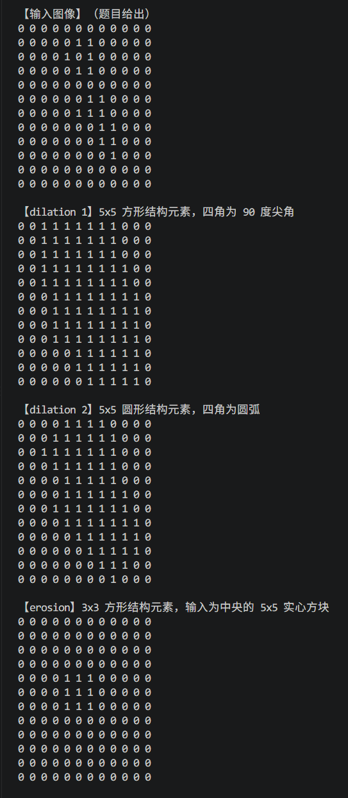
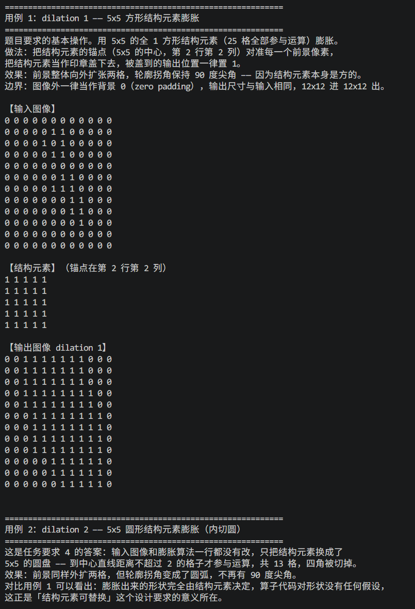
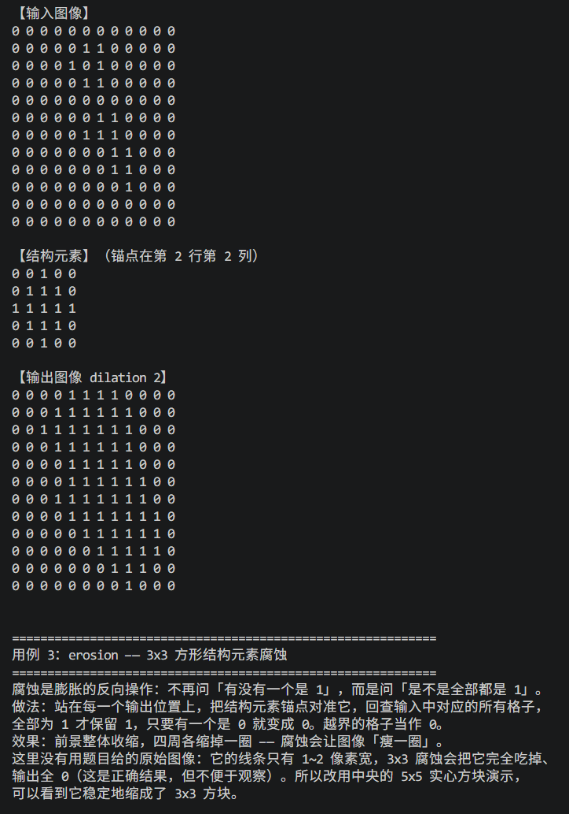
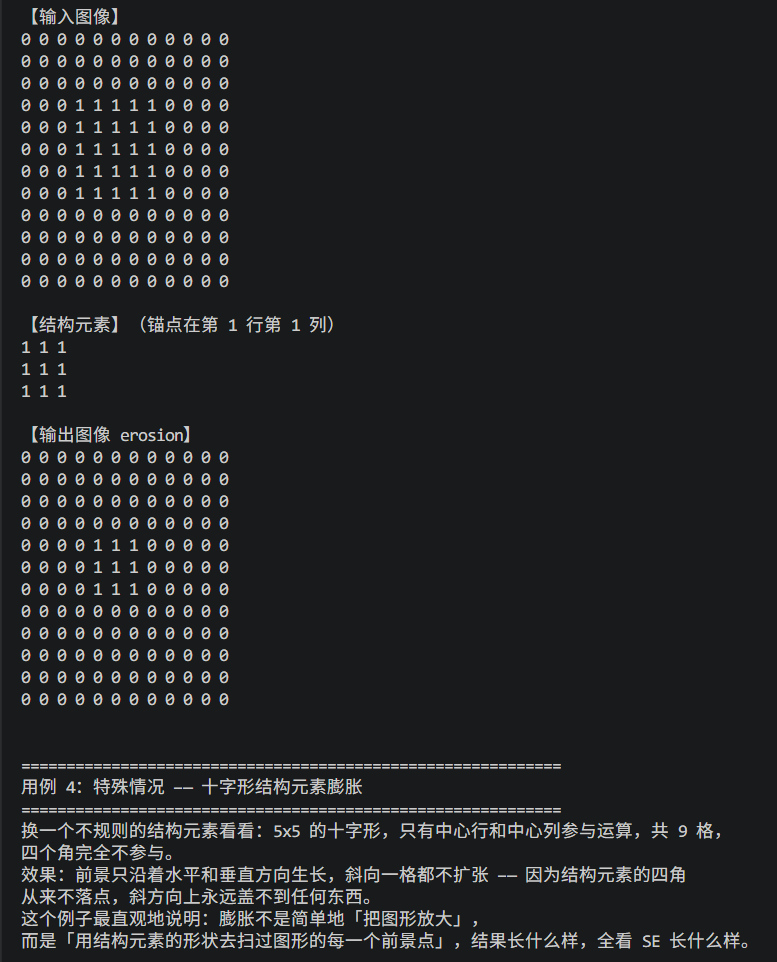
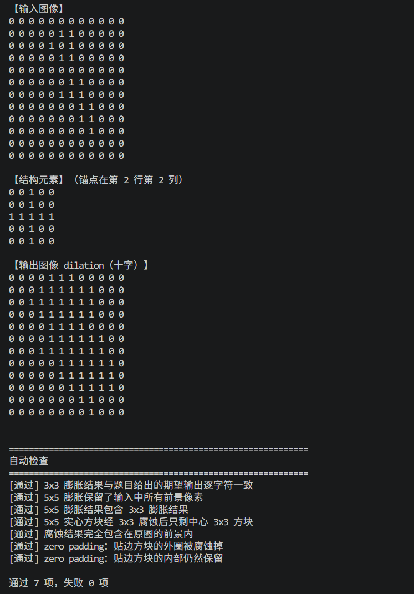

# cpp_morphology

RoboMaster - 南京理工大学 Alliance 战队 2027 赛季算法组竞培营第一周任务 V1.0

任务二：区域膨胀算法

用 C++ 实现的二值形态学处理管线：对二值图像做膨胀（dilation）和腐蚀（erosion）。使用面向对象和模块化的设计思路，使得膨胀或者腐蚀的结构元素可以替换。

> AI 创作声明：本项目在 `hy4 preview` 的辅助下完成 ~~（真的还挺好用的）~~。其中， `include/*.h` 和 `src/*.cpp` 由人类在 AI 的教学、指引、检查和纠错下完成，`tests/test_morphology.cpp` 完全由 AI 完成，`README.md` 由 AI 完成主体部分，人类进行了部分修改和润色。

---

## 快速开始

```bash
# 需要 C++17
mkdir -p build

# 演示程序：打印输入图像、dilation 1、dilation 2、erosion
g++ -std=c++17 -Iinclude src/*.cpp -o build/morphology
./build/morphology

# 测试程序：四个测试用例 + 自动检查
g++ -std=c++17 -Iinclude \
    src/BinaryImage.cpp src/StructuringElement.cpp src/Morphology.cpp \
    tests/test_morphology.cpp -o build/test_morphology
./build/test_morphology
```

注意：编译测试时要排除 `src/main.cpp`，否则会出现两个 `main` 函数。

---

## 项目结构

```
cpp_morphology/
├── include/                    # 头文件
│   ├── BinaryImage.h           # 二值图像
│   ├── StructuringElement.h    # 结构元素
│   └── Morphology.h            # 形态学算子（Dilation / Erosion）
├── src/
│   ├── BinaryImage.cpp
│   ├── StructuringElement.cpp
│   ├── Morphology.cpp
│   └── main.cpp                # 演示入口
├── tests/
│   └── test_morphology.cpp     # 测试用例 + 自动检查
└── .clangd                     # clangd 配置（让 IDE 能找到头文件）
```

---

## 核心概念

所有坐标都是 0-based 数组下标。图像中 `1` 表示前景，`0` 表示背景。

### 膨胀（dilation）

> 对输出位置，问：SE 覆盖到的输入像素里，有没有一个是 1？有就是 1。

本项目用「盖章法」实现：准备一张空白输出图，遍历输入中每个前景像素，把 SE 当作印章、锚点对准它盖下去，被盖到的位置置 1。落到图像外的部分直接丢弃。

### 腐蚀（erosion）

> 对输出位置，问：SE 覆盖到的输入像素，是不是全是 1？全是才是 1，有一个 0 就是 0。

本项目用「探针法」实现：站在每个输出位置上，回查输入中 SE 覆盖的所有格子，全部为 1 才保留。

### 边界策略

图像外的像素一律当作背景 0，输出尺寸与输入相同。

这带来一个可预期的效果：腐蚀之后图像最外一圈必然全为 0（因为它们的邻域一定探到了图像外）。测试里专门有一条检查这件事。

### 锚点

SE 上“对准当前像素”的那个格子。奇数尺寸的 SE 有唯一中心锚点；偶数尺寸会向下取整（偏移半格）。

锚点允许落在 SE 外面 —— 那等价于把整个 SE 平移一段距离，数学上是良好定义的，所以代码不做校验。

---

## 类设计

### `BinaryImage` —— 二值图像

```cpp
BinaryImage(int row_count, int col_count, int initial_value = 0)  // 全 0（或全 1）矩阵
BinaryImage(const std::vector<std::vector<int>>& data)            // 从二维数组构造，自动推导尺寸

int  row_count() const
int  col_count() const
int  read_pixel(int row, int col) const                           // 越界抛异常
int  read_pixel_with_fallback(int row, int col, int fallback) const // 越界返回 fallback
void write_pixel(int row, int col, int value)                     // 值必须是 0 或 1
bool is_inside(int row, int col) const
std::string to_text() const                                       // 转成可打印的文本
```

不暴露内部容器，也不提供返回引用的访问器。 否则外面能把某一行 `resize` 成不同长度，图像就不再是矩形。外部只能通过接口访问。

**禁止 `std::vector<bool>`**：它按位压缩，`operator[]` 返回的是代理对象而非 `bool&`，取不了引用。

### `StructuringElement` —— 结构元素

```cpp
StructuringElement(const std::vector<std::vector<int>>& mask, int anchor_row, int anchor_col)

int  row_count() const
int  col_count() const
bool is_active(int row, int col) const   // 这一格参不参与运算
int  anchor_row() const
int  anchor_col() const
std::string to_text() const
```

三个形状工厂（自由函数）：

```cpp
rectangle(row_count, col_count)   // 全 1 矩形，锚点自动取中心
disk(radius)                      // 圆盘：到中心直线距离 <= radius，锚点自动取中心
cross(radius)                     // 十字：只有中心行和中心列
```

> **为什么是组合而不是继承？** SE 确实包含一个二维 0 / 1 网格，但它**不是**一种图像 —— 图像里的 0 是"背景像素"，SE 里的 0 是"这一格不参与运算"，语义不同。用组合（`mask_` 成员）复用存储。

接口叫 `is_active` 而不是 `read_pixel`，就是为了提醒：这里的值回答的是"参不参与运算"，不是"是什么颜色"。

### `Dilation` / `Erosion` —— 形态学算子

```cpp
BinaryImage apply(const BinaryImage& input_image, const StructuringElement& element) const;
```

两个类都是**无状态**的，SE 每次调用时传入、不持有。它们没有共同基类 —— 因为盖章法和探针法的算法骨架不同，现在抽象基类属于过早设计。

---

## 测试用例

`tests/test_morphology.cpp` 里四个用例，每个都打印说明、输入图像、结构元素（含锚点位置）和输出图像：

| 用例 | 输入 | 结构元素 | 看点 |
|---|---|---|---|
| 1 | 题目原图 | `rectangle(5, 5)` 方形，25 格 | 外扩两格，四角是 **90° 尖角** |
| 2 | **同一张原图** | `disk(2)` 圆盘，13 格 | 外扩两格，四角是**圆弧** |
| 3 | 中央 5×5 实心方块 | `rectangle(3, 3)` | 缩一圈变成 3×3 方块 |
| 4 | 题目原图 | `cross(2)` 十字，9 格 | 只沿水平/垂直生长，斜向不扩张 |


```
方形 SE（最后一行）：  0 0 0 0 0 0 1 1 1 1 1 0    ← 底部一整条，尖角
圆盘 SE（最后一行）：  0 0 0 0 0 0 0 0 1 0 0 0    ← 只剩一个点，圆角
```

用例 3 没有用题目原图：它的线条只有 1~2 像素宽，3×3 腐蚀会让输出全为 0，不便于观察，所以改用实心方块演示。

### 自动检查（7 项）

除了逐字符比对期望输出，还有几条基于数学性质的检查：

- 膨胀结果包含原图所有前景（膨胀只增不减）
- 5×5 膨胀结果包含 3×3 膨胀结果（SE 越大结果越大）
- 腐蚀结果完全包含在原图前景内（腐蚀只减不增）
- 贴边方块腐蚀后外圈消失、内部保留（验证 zero padding）

---

## 运行截图：






